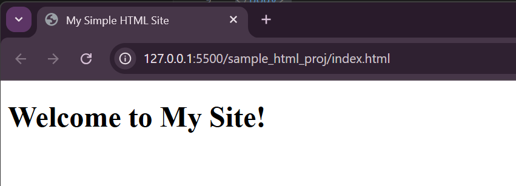
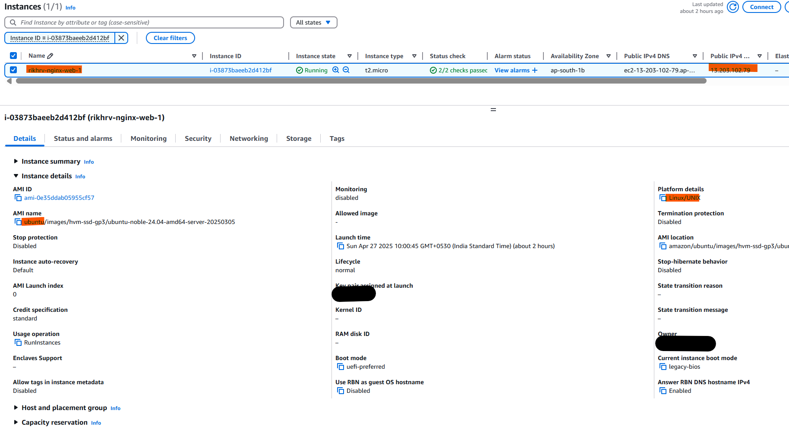
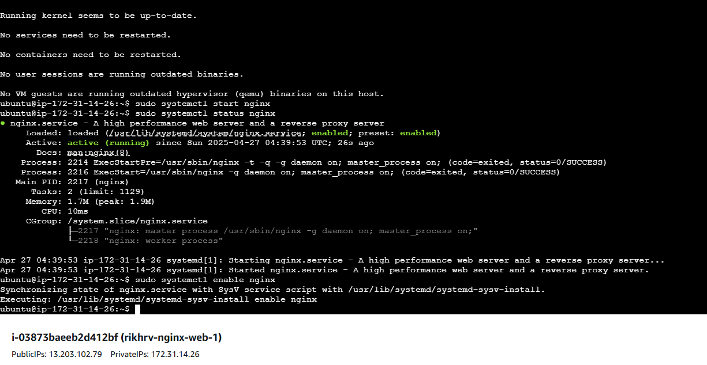
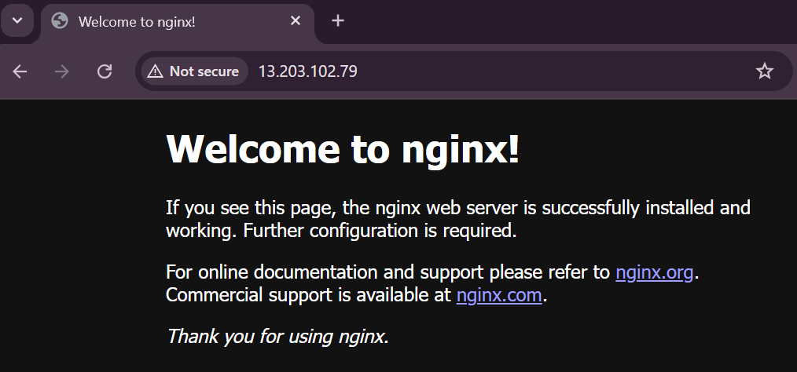

# CI/CD Basic  Implementation 
Create a complete **CI/CD** pipeline using bash, python, and crontabs, AWS services with sample html project.

## 1. Set Up a Simple HTML Project :
-  [[sample_html_proj]](https://github.com/Rakesh095-dvops/sample_html_proj.git) github repo sample html project (<i>live server VS code preview</i>)
    
## 2. Set Up and Configure AWS EC2 Instance  :
-  Set up a Basic AWS EC2 Setup with ``OS: Ubuntu 22.04 LTS (recommended)`` and Nginx
```bash
    #1. install and configure nginx
    sudo apt update
    sudo apt install nginx -y
    sudo systemctl start nginx
    sudo systemctl enable nginx
    #2. check nginx status
    sudo systemctl status nginx
```
### 2.1 AWS EC2 
> **Note:** EC2 instances has been set up with no static IP or DNS assigned.So public ip will changes in every instance restart
-   
-   

### 2.2 Nginx Home Page with OOTB page

-   

### 2.3 Custom project set up 

- Create project directory & provide current user modification permission.

    ```bash
    # 1. set up custom project deployment directory
    sudo mkdir -p /var/www/proj
    sudo chown -R $USER:$USER /var/www/proj
    # 2. set up staging directory
    sudo mkdir -p /var/www/proj-temp
    sudo chown -R $USER:$USER /var/www/proj-temp
    ```
- To reflect the custom index.html file modify root folder in ```default``` nginx EC2 instance

    ```bash
    # 1. edit the file
    sudo nano /etc/nginx/sites-available/default
    # 2. replace the default OOTB root directory /var/www/html
    root /var/www/proj; 
    ```
- Initialize git account set up in EC2 and add "Add SSH key" to the respective github account

    ```bash
    # 1. create ssh key for easy push and pull from git repository
    ssh-keygen -t rsa -b 2048 -C "{user@emailaddress.com}"
    # 2. view the contents of the public key file
    cat .ssh/id_rsa.pub
    ```

    >**Best Practices**-Use SSH keys with GitHub to allow passwordless ```git pull```. update ```ssh-keyscan github.com >> ~/.ssh/known_hosts```.
## 3. CI/CD Script Configuration : 

- ```check_commits.py``` & ```deploy.sh``` script combined will check for new commits from [[sample_html_proj]](https://github.com/Rakesh095-dvops/sample_html_proj.git) github repo and deploy the ```index.html``` to ```/var/www/proj```.

    - Create CI/CD pipeline location and install required python library.
        ```bash
        # 1. set up script directory
        mkdir cicd_pipeline
        # 2. clone the repository 
        git clone https://github.com/Rakesh095-dvops/CICD_basic_hrv
        # 3. Make it executable
        chmod +x deploy.sh
        ```
    - Set up virtual python environment and required python lib only needed for this project 
        ```bash
        # 1. Install the venv module (if not already installed)
        sudo apt install python3-venv
        # 2. Create a virtual environment
        python3 -m venv cicd_pipeline/CICD_basic_hrv/ # Replace /path/to/your/venv
        # 3. Activate the virtual environment
        source cicd_pipeline/CICD_basic_hrv/bin/activate
        # 4. Install packages using pip within the virtual environment
        pip install jsons requests python-dotenv
        # 5. Deactivate the virtual environment when you're done
        deactivate
        ```
        > **Note:** Use apt (for system-wide packages, if available): like ```sudo apt install python3-requests```.

    - Create ```.env``` file in working directory ```~/cicd_pipeline/CICD_basic_hrv/ ``` to works with ```check_commits.py```.

        ```bash
        GITHUB_TOKEN={GITHUB_TOKEN}
        REPO_OWNER=Rakesh095-dvops
        REPO_NAME=sample_html_proj
        BRANCH=main
        DEPLOYSCRIPT_LOC=/{ABSOLUTE_PATH}/deploy.sh
        ```
    -  Set Up a Cron Job to Run the Python Script 
        ```bash
        # 1. run crontab
        sudo crontab -e 
        # 2. configure Every 5 minutes check for new commits.
        # Logs to /home/ubuntu/cron.log.
        */5 * * * * /home/ubuntu/cicd_pipeline/CICD_basic_hrv/bin/python3  /home/ubuntu/cicd_pipeline/CICD_basic_hrv/check_commits.py  >> /home/ubuntu/cron.log 2>&1
        ```

## 3. Demo 
