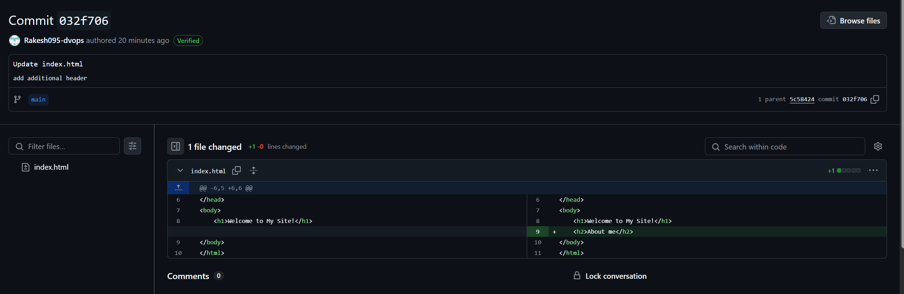

# CI/CD Basic Implementation

This project demonstrates a complete **CI/CD pipeline** using Bash, Python, Crontabs, and AWS services with a sample HTML project.

---

## 1. Set Up a Simple HTML Project

- GitHub Repository: [sample_html_proj](https://github.com/Rakesh095-dvops/sample_html_proj.git)  
  <i>Live server preview using VS Code</i>


---

## 2. Set Up and Configure AWS EC2 Instance

### 2.1 Basic AWS EC2 Setup

- **OS**: Ubuntu 22.04 LTS (recommended)
- **Web Server**: Nginx

#### Steps to Install and Configure Nginx:
```bash
# 1. Install and configure Nginx
sudo apt update
sudo apt install nginx -y
sudo systemctl start nginx
sudo systemctl enable nginx

# 2. Check Nginx status
sudo systemctl status nginx
```

### 2.2 AWS EC2

> **Note:** EC2 instances have been set up with no static IP or DNS assigned. The public IP will change with every instance restart.

- 
- 

### 2.3 Nginx Home Page with OOTB Page

- 

### 2.4 Custom Project Setup

- Create a project directory & provide current user modification permission.

    ```bash
    # 1. Set up custom project deployment directory
    sudo mkdir -p /var/www/proj
    sudo chown -R $USER:$USER /var/www/proj
    # 2. Set up staging directory
    sudo mkdir -p /var/www/proj-temp
    sudo chown -R $USER:$USER /var/www/proj-temp
    ```

- To reflect the custom `index.html` file, modify the root folder in the `default` Nginx EC2 instance.

    ```bash
    # 1. Edit the file
    sudo nano /etc/nginx/sites-available/default
    # 2. Replace the default OOTB root directory /var/www/html
    root /var/www/proj; 
    ```

- Initialize Git account setup in EC2 and add "Add SSH key" to the respective GitHub account.

    ```bash
    # 1. Create SSH key for easy push and pull from Git repository
    ssh-keygen -t rsa -b 2048 -C "{user@emailaddress.com}"
    # 2. View the contents of the public key file
    cat .ssh/id_rsa.pub
    ```

    > **Best Practices**: Use SSH keys with GitHub to allow passwordless `git pull`. Update `ssh-keyscan github.com >> ~/.ssh/known_hosts`.

---

## 3. CI/CD Script Configuration

- `check_commits.py` & `deploy.sh` script combined will check for new commits from [sample_html_proj](https://github.com/Rakesh095-dvops/sample_html_proj.git) GitHub repo and deploy the `index.html` to `/var/www/proj`.

    - Create CI/CD pipeline location and install required Python library.
        ```bash
        # 1. Set up script directory
        mkdir cicd_pipeline
        # 2. Clone the repository 
        git clone https://github.com/Rakesh095-dvops/CICD_basic_hrv
        # 3. Make it executable
        chmod +x deploy.sh
        ```

    - Set up virtual Python environment and required Python libraries only needed for this project.
        ```bash
        # 1. Install the venv module (if not already installed)
        sudo apt install python3-venv
        # 2. Create a virtual environment
        python3 -m venv cicd_pipeline/CICD_basic_hrv/ # Replace /path/to/your/venv
        # 3. Activate the virtual environment
        source cicd_pipeline/CICD_basic_hrv/bin/activate
        # 4. Install packages using pip within the virtual environment
        pip install jsons requests python-dotenv
        # 5. Deactivate the virtual environment when you're done
        deactivate
        ```

        > **Note:** Use apt (for system-wide packages, if available): like `sudo apt install python3-requests`.

    - Create `.env` file in the working directory `~/cicd_pipeline/CICD_basic_hrv/` to work with `check_commits.py`.

        ```bash
        GITHUB_TOKEN={GITHUB_TOKEN}
        REPO_OWNER=Rakesh095-dvops
        REPO_NAME=sample_html_proj
        BRANCH=main
        DEPLOYSCRIPT_LOC=/{ABSOLUTE_PATH}/deploy.sh
        ```

    - Set up a Cron Job to run the Python script.
        ```bash
        # 1. Run crontab
        sudo crontab -e 
        # 2. Configure: Every 5 minutes check for new commits.
        # Logs to /home/ubuntu/cron.log.
        */5 * * * * /home/ubuntu/cicd_pipeline/CICD_basic_hrv/bin/python3  /home/ubuntu/cicd_pipeline/CICD_basic_hrv/check_commits.py  >> /home/ubuntu/cron.log 2>&1
        ```

---

## 4. Demo

### 4.1 Initial CI/CD

- By scheduled Cronjob, the remote sample HTML project is pulled and deployed to an empty `/var/www/proj`. 

    - Helpful Commands:
        ```bash
        # Deployment log verification 
        sudo tail -f /var/log/deploy.log
        # Check Git commit details deployed in Nginx
        sudo tail -f /tmp/last_commit.txt
        # Crontab execution logs 
        sudo tail -f /home/ubuntu/cron.log
        grep CRON /var/log/syslog 
        ```

- Deployment successful on EC2:
    

- Deployment log verification:
    

- Cronjob logs for more details:
    

---

### 4.2 Changes in Git Repository

- [sample_html_proj](https://github.com/Rakesh095-dvops/sample_html_proj.git) code base has been updated.  


- Cron job ran custom `python` and its associated `sh` scripts. Relevant logs have been generated. Last commit has been updated with a new value.  


- Deployment logs:  


- Nginx working with updated `index.html`:  


- Cronjob logs ran multiple times; however, based on Git commit to [sample_html_proj](https://github.com/Rakesh095-dvops/sample_html_proj.git), Nginx deployables were updated.  
